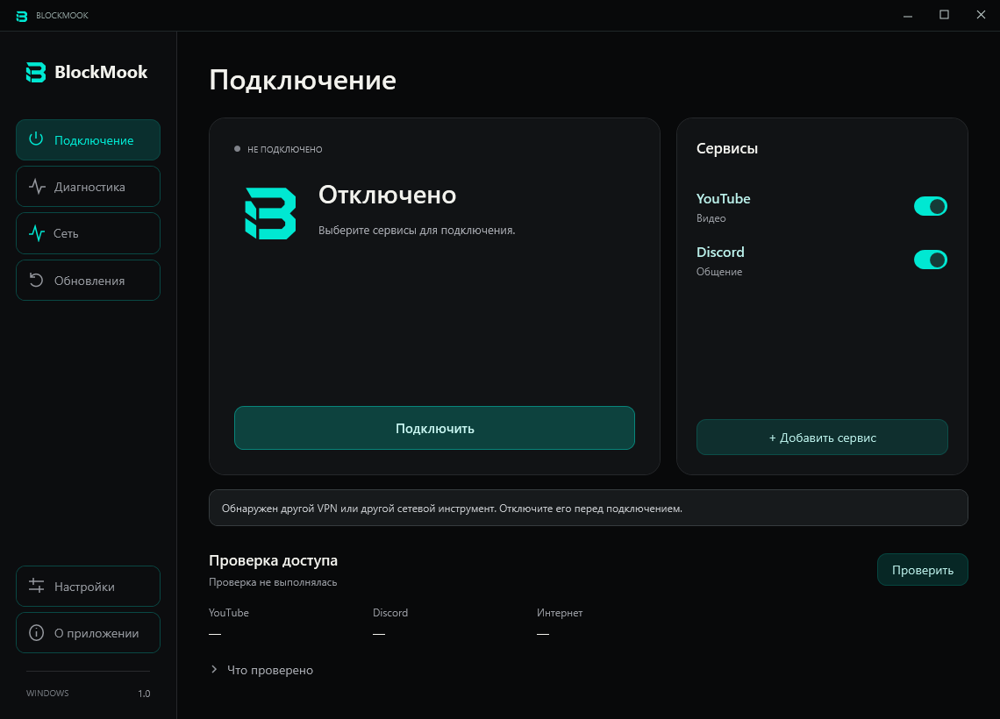
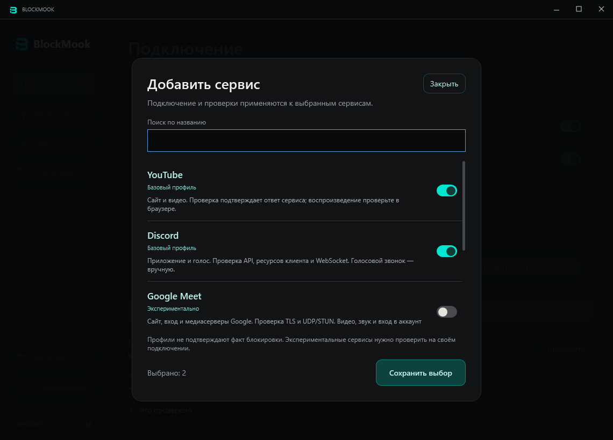
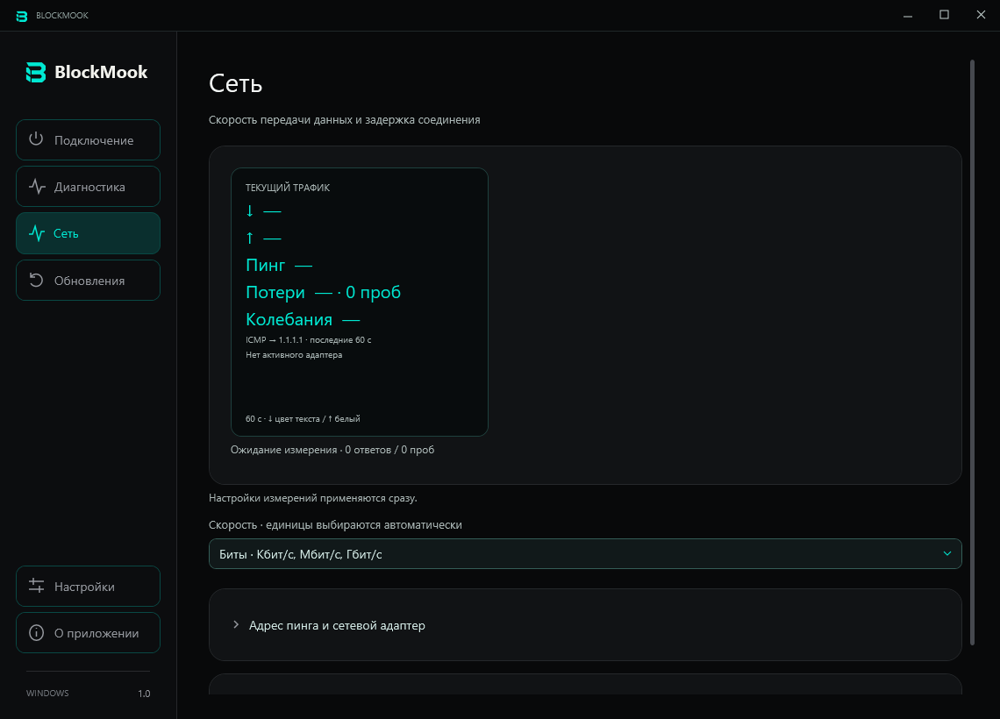
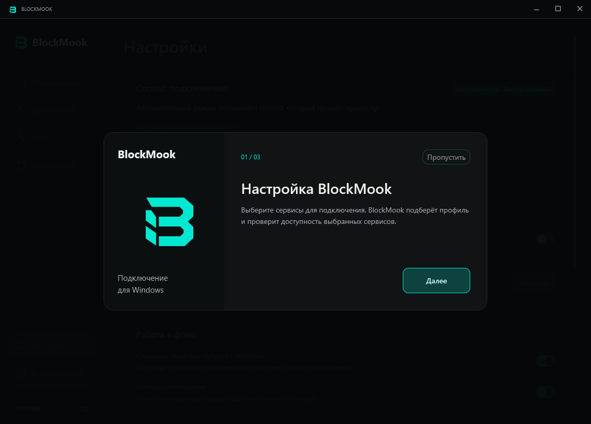
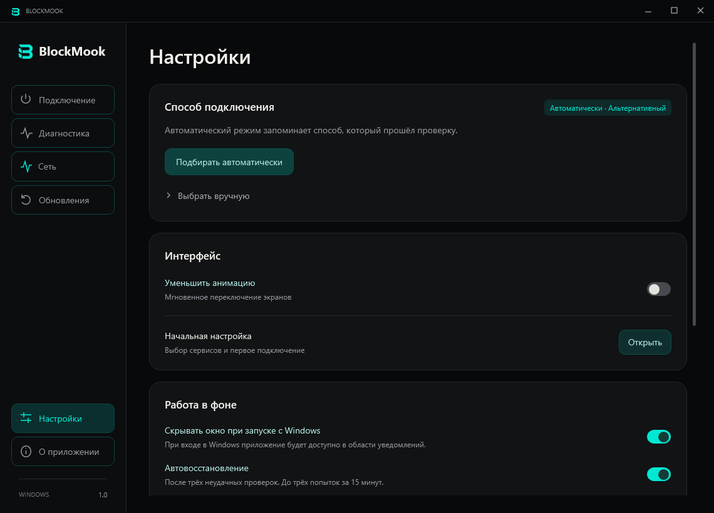
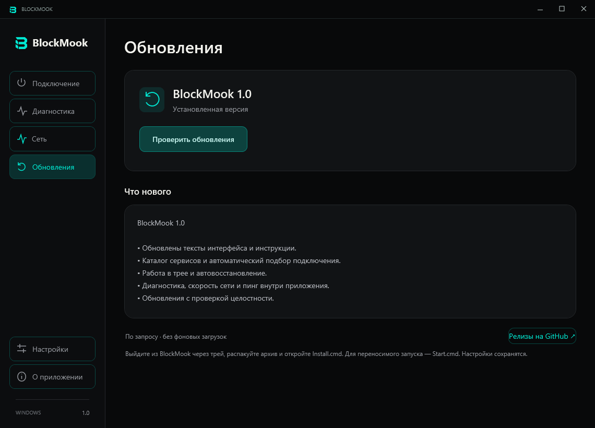

  <a href="https://github.com/BABYSHKABIKE/BlockMook/releases/latest/download/BlockMook-Windows-x64.zip"><b>Скачать для Windows</b></a> ·
  <a href="CHANGELOG.md">История изменений</a> ·
  <a href="https://github.com/BABYSHKABIKE/BlockMook/issues">Сообщить об ошибке</a>

BlockMook — приложение для Windows для восстановления доступа к интернет-сервисам. Программа подбирает профиль подключения, проверяет доступность выбранных сервисов и повторяет подключение при сбоях.

**Версия 1.0** · Windows 10/11 x64 · .NET Framework 4.8

## Возможности

- Выбор сервисов и автоматический подбор профиля подключения.
- Работа в трее, ярлык на рабочем столе и запуск вместе с Windows.
- Автовосстановление с ограничением повторных попыток.
- Диагностика соединений и экспорт отчёта.
- Скорость передачи данных, пинг и потери ICMP-ответов в окне приложения.
- Проверка обновлений и загрузка архива с проверкой SHA-256.

## Установка

1. [Скачайте архив](https://github.com/BABYSHKABIKE/BlockMook/releases/latest/download/BlockMook-Windows-x64.zip) и распакуйте его целиком.
2. Запустите **Install.cmd**. Установщик создаст ярлык на рабочем столе.
3. Откройте BlockMook, выберите сервисы и нажмите **Подключить**. Для запуска сетевого компонента требуется подтверждение прав администратора.

Для запуска без установки используйте **Start.cmd**. При наличии активного VPN или другого сетевого инструмента отключите его перед проверкой BlockMook. Исполняемый файл пока не подписан сертификатом издателя.

Для перехода с прежних выпусков 1.1/1.2 необходимо вручную скачать архив, полностью закрыть приложение и запустить **Install.cmd**. Настройки сохраняются. Автоматическая проверка в этих выпусках не предлагает переход на 1.0 из-за сравнения номеров версий.

## Интерфейс

| Сервисы | Монитор сети |
| --- | --- |
|  |  |

Начальная настройка, параметры и обновления

## Поддержка и ограничения

Доступность сервисов зависит от провайдера и профиля подключения. Поддержка Google Meet и Signal экспериментальная; для Viber поддерживается только сайт. Проверка соединения не подтверждает работу авторизации, видео или звонков. Подробности: [поддерживаемые сервисы](docs/services.md).

Обновления проверяются вручную. Диагностика обращается к выбранным сервисам, монитор пинга — к указанному IP-адресу. Измерения сети выполняются только при открытом разделе «Сеть» и не записываются в постоянный журнал. [Монитор сети](docs/network.md) · [Работа в фоне](docs/desktop.md).

Совместимость с античитами не подтверждена. В приложении нет игрового оверлея; используемый сетевой компонент может конфликтовать с защитой отдельных игр. [Информация о совместимости](docs/anticheat.md).

## Разработка и обратная связь

Для сборки выполните `prepare-engine.ps1`, `build.ps1` и `test.ps1` в Windows PowerShell. Для подготовки архива выполните `package.ps1`. [Автоматические проверки](https://github.com/BABYSHKABIKE/BlockMook/actions) выполняются при изменении исходного кода. Готовые сборки доступны в [Releases](https://github.com/BABYSHKABIKE/BlockMook/releases/latest).

В [сообщении об ошибке](https://github.com/BABYSHKABIKE/BlockMook/issues) укажите версию Windows, шаги воспроизведения и ожидаемый результат. Перед публикацией диагностического отчёта проверьте его на наличие личных данных.

## Авторство и лицензии

BlockMook разрабатывается [BABYSHKABIKE](https://github.com/BABYSHKABIKE). Сетевой компонент основан на открытом коде [zapret от bol-van](https://github.com/bol-van/zapret) и дистрибутиве [Flowseal](https://github.com/Flowseal/zapret-discord-youtube); используются WinDivert и Cygwin. Код приложения распространяется по лицензии [MIT](LICENSE). Уведомления об авторстве, лицензии и исходники сторонних компонентов включены в архив; перечень приведён в [THIRD-PARTY.md](THIRD-PARTY.md).
