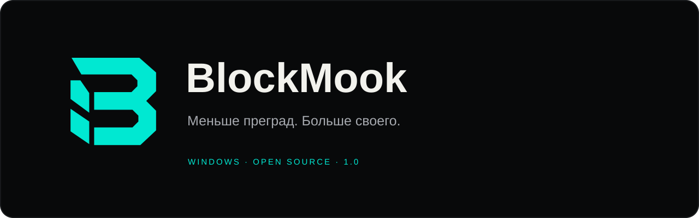
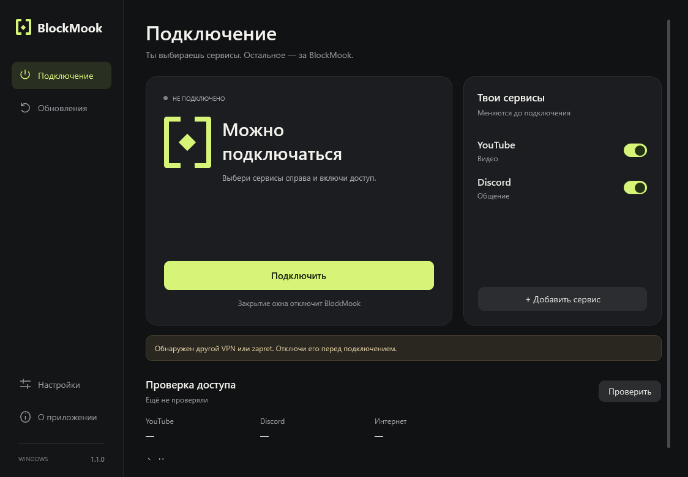
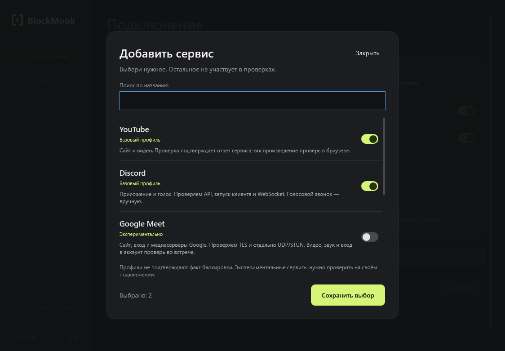
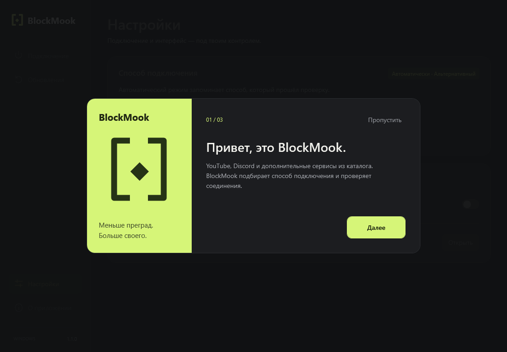
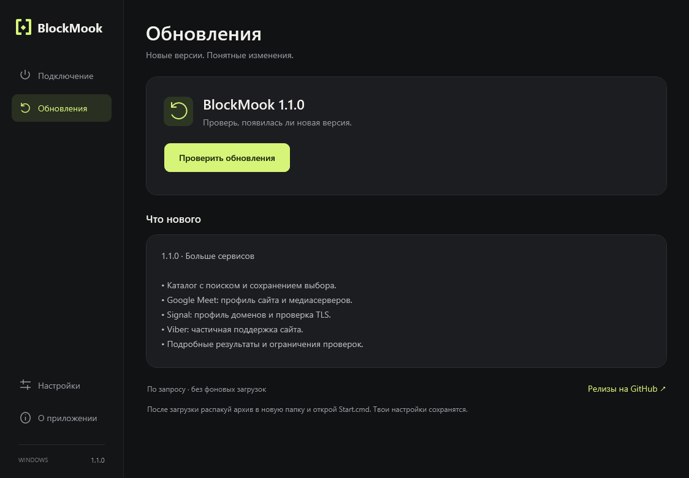

<p align="center">
  <a href="https://github.com/BABYSHKABIKE/BlockMook/releases/latest"><b>Скачать для Windows</b></a> ·
  <a href="CHANGELOG.md">Что нового</a> ·
  <a href="THIRD-PARTY.md">Авторы и компоненты</a> ·
  <a href="https://github.com/BABYSHKABIKE/BlockMook/issues">Сообщить о проблеме</a>
</p>

**BlockMook** — открытое Windows-приложение для управления zapret: каталог сервисов, автоматический подбор подключения и понятная диагностика. Без аккаунта и установки отдельного zapret.

YouTube и Discord сохраняют прежние профили. Google Meet и Signal добавлены как экспериментальные; Viber пока поддерживается частично, на уровне сайта. [Что поддерживается и проверяется](docs/services.md).



## Начать за минуту

1. Скачай **BlockMook-Windows-x64.zip** из [последнего релиза](https://github.com/BABYSHKABIKE/BlockMook/releases/latest).
2. Распакуй **весь архив** в свою папку. Открой **Start.cmd**.
3. Отключи другой VPN или zapret, выбери сервисы и нажми **Подключить**.
4. Подтверди запрос прав Windows для сетевого компонента и дождись результата.

Закрытие окна или кнопка **Отключить** останавливает компонент BlockMook. Для работы нужны Windows 10/11 **x64** и .NET Framework 4.8. Доступ зависит от провайдера: статус частичного доступа не выдаётся за успешное подключение.

## Как устроено приложение

| Экран | Что можно сделать |
| --- | --- |
| **Подключение** | Добавить сервисы из каталога, подключиться, посмотреть результаты проверок. |
| **Обновления** | Проверить GitHub, прочитать изменения, скачать архив с проверкой SHA-256. |
| **Настройки** | Выбрать автоматический или ручной профиль, уменьшить анимацию, повторить знакомство. |
| **О приложении** | Узнать об исходных проектах, запустить диагностику, открыть локальные отчёты. |

Автоматический режим пробует до трёх профилей. Выбранный профиль сохраняется для соответствующего набора сервисов после **двух успешных проверок**. Диагностика проверяет все способы и затем отключает подключение.

<details>
<summary>Знакомство и обновления</summary>





</details>

## На чём основан BlockMook

Мы не создавали сетевой движок zapret и не приписываем себе работу его авторов. BlockMook — самостоятельный интерфейс и управляющее приложение поверх существующих открытых компонентов.

| Проект | Использование |
| --- | --- |
| [bol-van/zapret](https://github.com/bol-van/zapret) | Сетевой движок и способы обхода DPI. |
| [Flowseal/zapret-discord-youtube](https://github.com/Flowseal/zapret-discord-youtube/tree/1.10.2) | Дистрибутив **1.10.2**, из которого взяты неизменённые бинарные компоненты и образцы пакетов; основа конфигураций YouTube/Discord. |
| [Basil/WinDivert](https://github.com/basil00/WinDivert) | Перехват сетевых пакетов в Windows. |
| [Cygwin](https://cygwin.com/) и Newlib | Среда выполнения, необходимая winws. |

**Что добавлено в BlockMook:** интерфейс и айдентика; выбор сервисов; автоматический перебор и проверка профилей; четыре проверки запуска Discord; отдельный процесс с повышенными правами; управление жизненным циклом собственного движка; диагностика, локальные отчёты и настройки; загрузка обновлений из GitHub Releases.

Код приложения распространяется по [MIT](LICENSE). Сторонние компоненты сохраняют свои лицензии. Полные уведомления, версии и происхождение — [THIRD-PARTY.md](THIRD-PARTY.md). Лицензии и архивы исходников библиотек включены в каждый ZIP-релиз.

## Обновления и данные

Обновления проверяются **только по кнопке**. Приложение обращается к публичному репозиторию `BABYSHKABIKE/BlockMook`, принимает стабильные релизы и сверяет размер и SHA-256 архива с метаданными GitHub. Перенаправления загрузки ограничены серверами GitHub. Токены и вход в аккаунт не нужны.

В версии 1.1 обновление скачивается как ZIP: после загрузки распакуй его в новую папку и открой `Start.cmd`. Автоматической замены запущенной программы пока нет. Настройки сохранятся. Проверка SHA-256 подтверждает целостность загрузки; сборка пока не имеет цифровой подписи издателя.

- Настройки: `%LOCALAPPDATA%\BlockMook`. При первом запуске подхватываются настройки предыдущего приложения «Просвет», если они есть.
- Загрузки: `%LOCALAPPDATA%\BlockMook\Updates`.
- Отчёты подключений и диагностики: `reports` рядом с `Start.cmd`.
- Журнал сеанса хранится в памяти и ограничен по размеру. Телеметрии нет.

Проверки доступа обращаются к выбранным сервисам и Microsoft. Для Google Meet также выполняется UDP/STUN-запрос к Google. BlockMook **не является VPN** и не скрывает IP-адрес. Успешная проверка не гарантирует вход в аккаунт, видео или звонок. DNS, прокси и автозапуск Windows приложение не меняет. Локальные отчёты могут содержать пути и диагностические сообщения — просмотри их перед публикацией.

## Собрать из исходников

На Windows с .NET Framework 4.8, PowerShell 5.1+ и Git:

```powershell
git clone https://github.com/BABYSHKABIKE/BlockMook.git
cd BlockMook
.\prepare-engine.ps1
.\build.ps1
.\test.ps1
.\Start.cmd
```

`prepare-engine.ps1` получает **семь конкретных файлов** из указанного тега Flowseal и проверяет `engine.lock`. Сборка отказывается принимать файлы с другими хешами. Новых NuGet-зависимостей нет; интерфейс использует WPF и системные шрифты Windows.

Для подготовки переносимого архива:

```powershell
.\prepare-sources.ps1
.\package.ps1
```

Сборка ZIP использует явный список файлов. Личные отчёты, настройки, загрузки и тестовые результаты в него не попадают. Архивы и исполняемые файлы публикуются в **Releases**, а не в Git-истории.

## Проверки и вклад

[CI](https://github.com/BABYSHKABIKE/BlockMook/actions) собирает приложение на Windows, проверяет логику подключения, IPC, отмену операций, настройки, обработку обновлений и навигацию WPF. Тестовые отчёты помечены как тестовые; они не являются измерением доступности сети.

Проверка параметров настоящего движка выполняется отдельно через `--engine-test <путь-к-отчёту>` и `winws --dry-run`. Она не включает перехват трафика; исполняемый файл движка запрашивает права администратора. Изменения сетевых стратегий требуют отдельной проверки на реальном подключении.

Для ошибки укажи версию Windows и BlockMook, шаги воспроизведения и ожидаемый результат. Не публикуй токены, личные адреса или необработанные отчёты. Изменения и исправления приветствуются через issues и pull requests.
