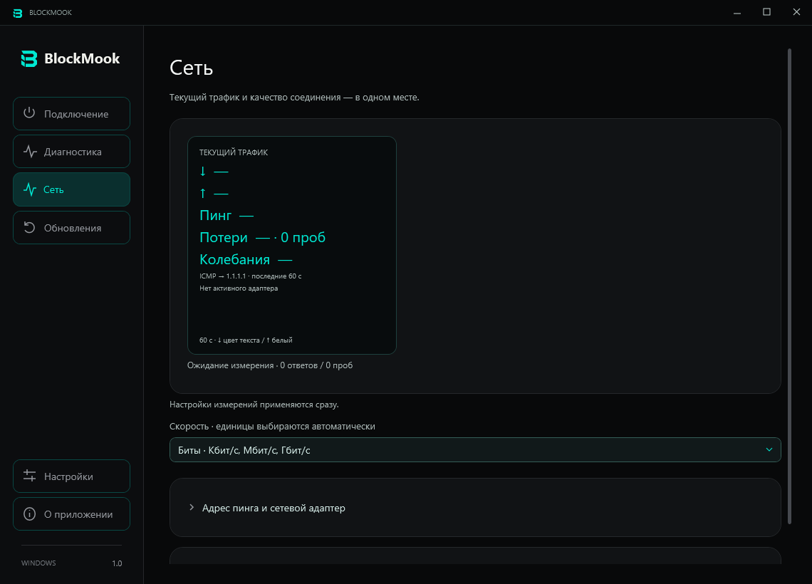
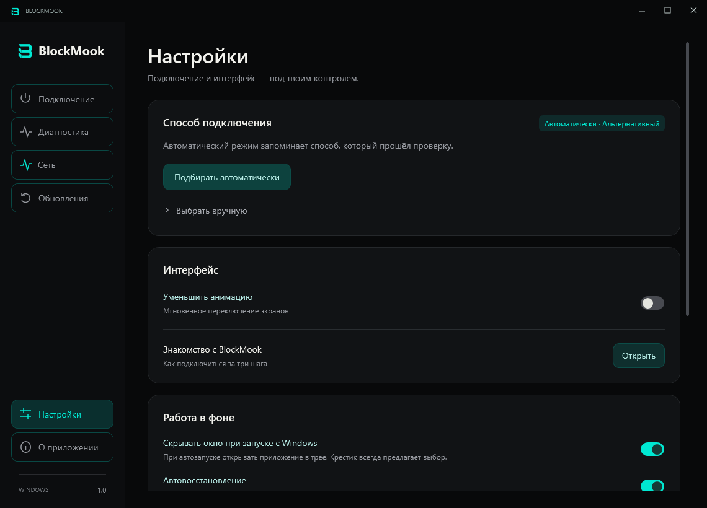

  <a href="https://github.com/BABYSHKABIKE/BlockMook/releases/latest/download/BlockMook-Windows-x64.zip"><b>Скачать BlockMook 1.0</b></a> ·
  <a href="https://github.com/BABYSHKABIKE/BlockMook/issues">Сообщить об ошибке</a> ·
  <a href="CHANGELOG.md">Что нового</a>

**Твои сервисы. Одно подключение.**

BlockMook — приложение для Windows, которое помогает восстановить доступ к привычным сервисам. Выбери нужные, нажми «Подключить» — приложение подберёт профиль и покажет результат проверки.

Чёрный интерфейс, бирюзовые акценты и понятное управление. Без регистрации и подписки на приложение.

## Что внутри

- **Каталог сервисов.** YouTube, Discord и дополнительные сервисы включаются по отдельности.
- **Автоматический подбор.** До трёх профилей подключения с повторной проверкой результата.
- **Работа в трее.** Закрой окно и выбери: продолжить в фоне или завершить программу полностью.
- **Автовосстановление.** Проверки соединения, ограниченные повторные попытки и приоритет ручного отключения.
- **Диагностика.** Понятные результаты и экспорт отчёта для разбора проблемы.
- **Монитор сети.** Текущая загрузка, отдача, пинг и потери ответов внутри приложения. Без игрового оверлея.
- **Обновления.** Проверка по кнопке и загрузка с контролем SHA-256.

## Установка

1. [Скачай архив для Windows](https://github.com/BABYSHKABIKE/BlockMook/releases/latest/download/BlockMook-Windows-x64.zip).
2. Распакуй его целиком и запусти **Install.cmd**. На рабочем столе появится ярлык BlockMook.
3. Выбери сервисы, нажми **Подключить** и подтверди запрос прав Windows.

Для переносимого запуска используй **Start.cmd** из распакованной папки. При первом запуске приложение покажет короткое знакомство. Если уже работает другой VPN или сетевой инструмент, отключи его перед отдельной проверкой BlockMook.

**Требования:** Windows 10/11 x64, .NET Framework 4.8. Права администратора запрашиваются для подключения. Приложение пока не подписано сертификатом издателя.

## Интерфейс

| Каталог сервисов | Сеть |
| --- | --- |
|  |  |

Знакомство, настройки и обновления

## Что стоит знать

Доступность зависит от провайдера и выбранного профиля. Google Meet и Signal имеют экспериментальную поддержку; Viber — частичную, на уровне сайта. Успешная проверка соединения не означает автоматически успешный голосовой звонок или воспроизведение видео. [Поддержка сервисов](docs/services.md).

Проверка обновлений запускается вручную. Для диагностики приложение обращается к выбранным сервисам, а монитор пинга — к указанному IP. Постоянного журнала сетевых измерений нет. [Измерения и настройки](docs/network.md) · [Работа в фоне](docs/desktop.md).

Совместимость с конкретными античитами не подтверждена. Удаление оверлея не является гарантией отсутствия конфликтов сетевого компонента. [Подробности для игр](docs/anticheat.md).

**Переход со старых выпусков 1.1/1.2:** один раз скачай текущий архив вручную, полностью закрой прежний BlockMook и запусти Install.cmd. Линейка публичных выпусков объединена в **1.0**; старый механизм сравнения версий не считает её обновлением.

## Обратная связь и исходный код

В [Issues](https://github.com/BABYSHKABIKE/BlockMook/issues) укажи версию Windows, шаги воспроизведения и ожидаемый результат. Перед публикацией отчёта проверь, что в нём нет личных данных.

Для сборки: клонируй репозиторий, выполни `prepare-engine.ps1`, `build.ps1` и `test.ps1`. Для архива — `package.ps1`. [Проверки Windows](https://github.com/BABYSHKABIKE/BlockMook/actions) выполняются автоматически. Исполняемые файлы распространяются через Releases.

## Авторство и лицензии

BlockMook — интерфейс, управление подключением, диагностика и обновления от [BABYSHKABIKE](https://github.com/BABYSHKABIKE). Сетевой компонент основан на открытом коде [zapret от bol-van](https://github.com/bol-van/zapret) и дистрибутиве [Flowseal](https://github.com/Flowseal/zapret-discord-youtube); используются WinDivert и Cygwin. Код приложения — [MIT](LICENSE), авторство и лицензии сторонних компонентов сохранены в [THIRD-PARTY.md](THIRD-PARTY.md) и архиве релиза.
